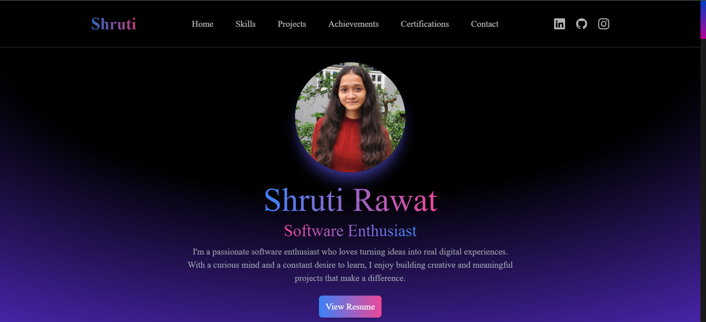

# Personal Portfolio Website

## Project Overview
The goal of this project was to build a **personal professional portfolio website**
to showcase my skills, projects, and achievements.

## Tech Stack
- React.js
- Tailwind CSS
- JavaScript

## Features
- Interactive portfolio and resume sections
- Functional contact form with email notifications (using online API)
- Clean and modern user interface
- Fully responsive design
- Deployed and live

## Live Demo
https://shruti-rawat.vercel.app/

## Screenshot

## Learning Outcome
- Improved understanding of React components
- Hands-on experience with frontend UI/UX
- Integration of third-party APIs
- Deploying a frontend application
